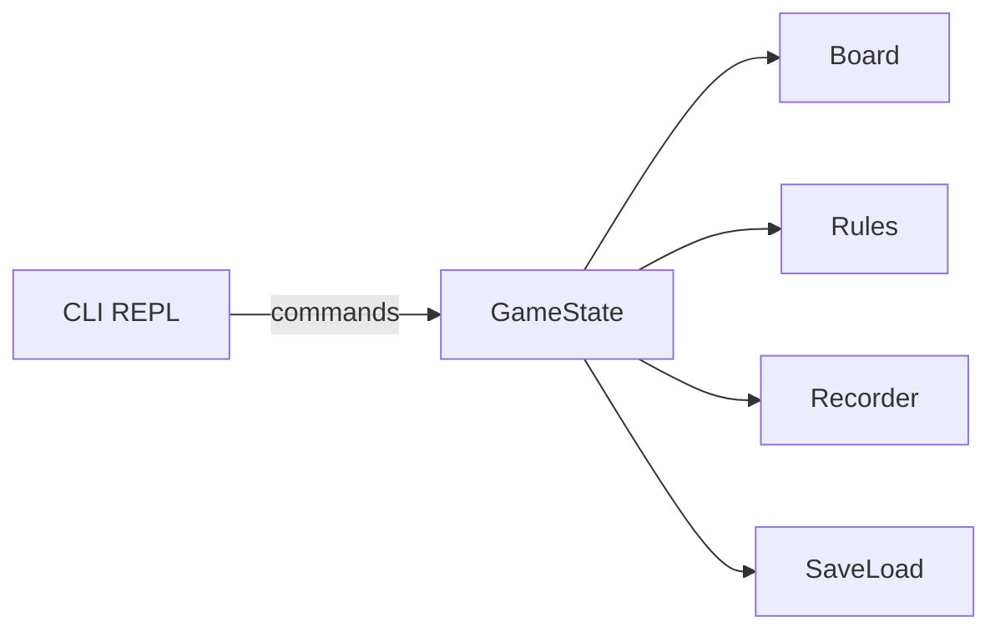
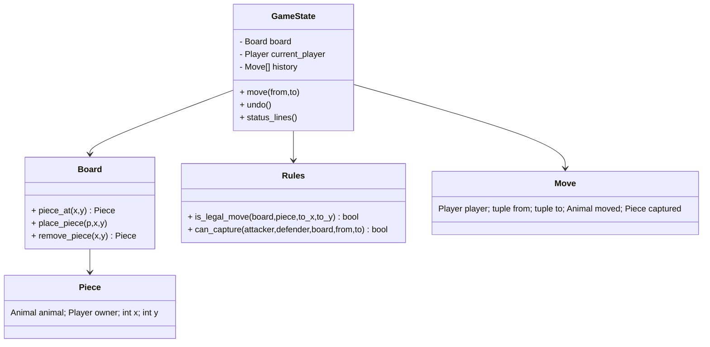
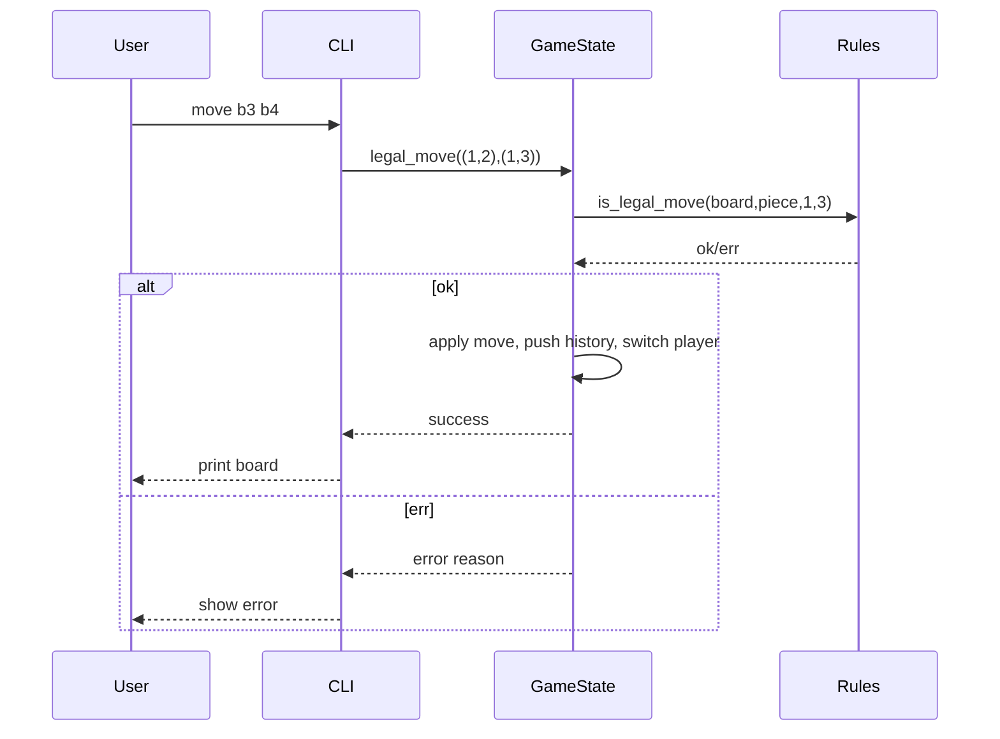

# Design Document

## Architecture
- Pattern: Model-View-Controller (MVC)
  - Model: `model/*` — board, rules, game state, save/load, recorder
  - View/Controller: `cli/main.py` — REPL parses commands, prints status
- Rationale: MVC isolates pure game logic (testable) from UI.

## Main Components

### Model classes
- `types.py`
  - `Player` (enum): P1, P2
  - `Animal` (enum): RAT..ELEPHANT with ranks 1..8
  - `SquareType` (enum): LAND, RIVER, TRAP_P1, TRAP_P2, DEN_P1, DEN_P2
  - `Piece` (dataclass): animal, owner, x, y
  - `Move` (dataclass): player, from_pos, to_pos, moved_animal, captured
- `board.py`
  - Constants for size and terrain; initial piece placement
  - APIs: `piece_at`, `place_piece`, `remove_piece`, `square_type`, `owner_pieces`
- `rules.py`
  - `is_legal_move(board, piece, to_x, to_y) -> (bool, reason)`
  - `can_capture(attacker, defender, board, from_pos, to_pos) -> bool`
  - Implements movement, river, den, trap, lion/tiger jump, rat/elephant exceptions.
- `game.py`
  - `GameState`: board, player turn, history, undo limit, winner check
  - Methods: `legal_move`, `move`, `undo`, `status_lines`, `reset`
- `save_load.py`
  - Save/Load `.jungle` JSON files (pieces, turn, names, counters)
- `recorder.py`
  - Start/stop `.record` and record move list; parse for replay.

### CLI
- `cli/main.py`
  - REPL commands; coordinate parsing; prints status board.

## Diagrams

### Architecture (Mermaid)

### Class relationships (Mermaid)

### Turn flow (Sequence)

## Exception handling
- Invalid commands => print usage and continue
- Illegal moves => print rule reason and keep turn
- File IO errors => show message and continue

## Justification
- Modularity and testability: rules isolated in `rules.py`, board state in `board.py`.
- Extendibility: additional commands or alternative UIs can reuse the `model`.
